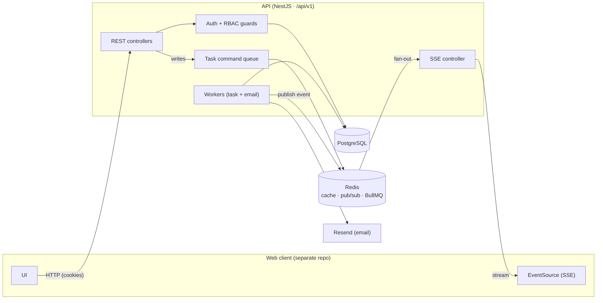
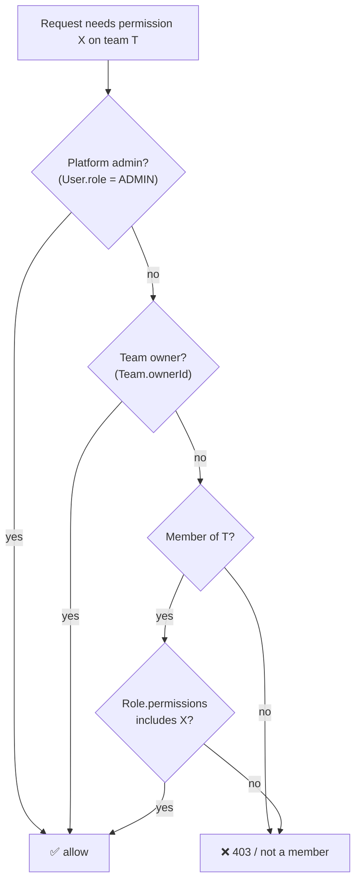
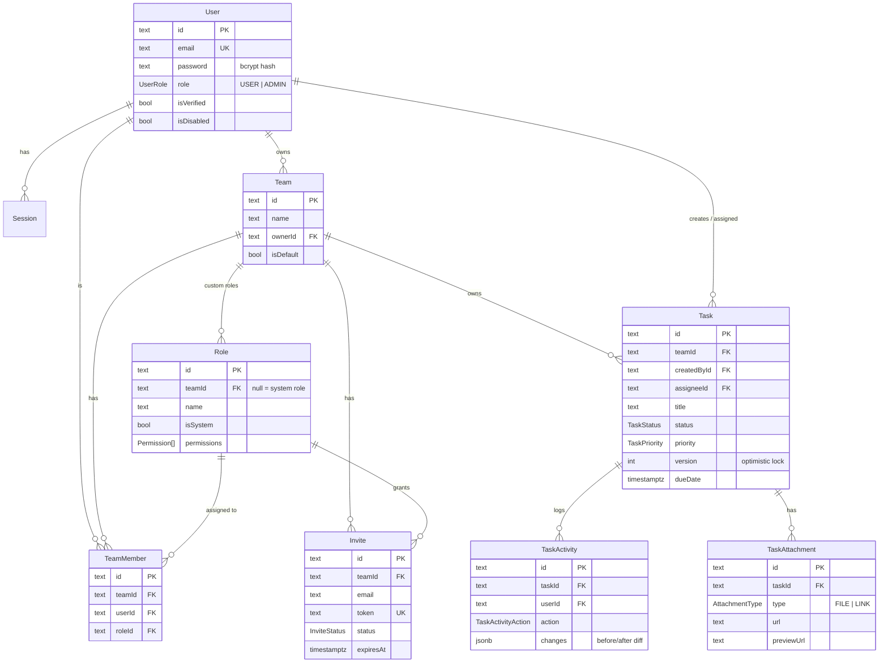
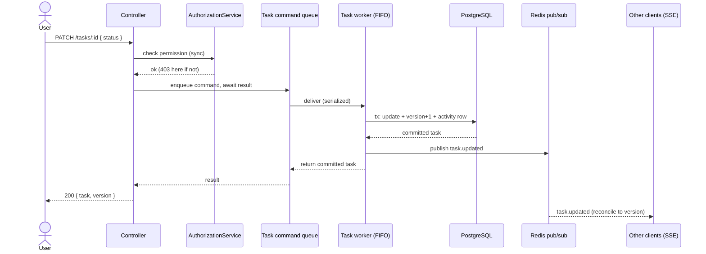
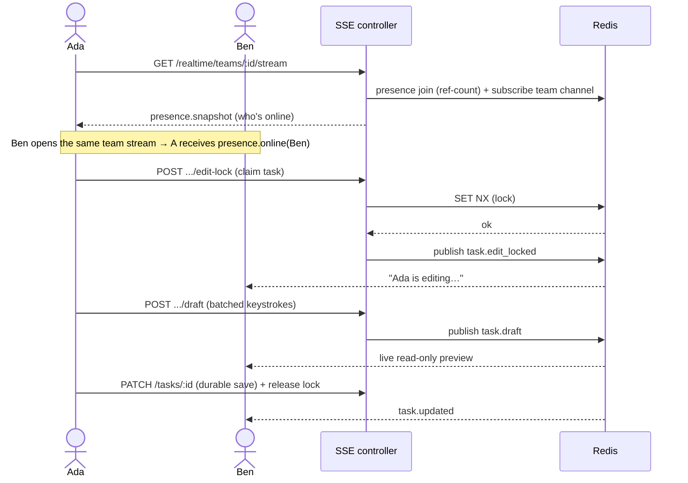

# Rival Tasks — API

The backend for a task manager built around **teams** and **real-time collaboration**. Multiple people work in the same workspace, see each other live, and watch tasks change as they happen — without stepping on each other's edits.

This is a REST + SSE API (NestJS, PostgreSQL, Redis, BullMQ). The web client (Next.js) lives in a separate repository and consumes this API.

> **Status:** complete — auth, RBAC, tasks, teams, invites, real-time, attachments, and admin, with tests, lint, and typecheck all green.

---

## Table of contents

- [What it does](#what-it-does)
- [Tech stack](#tech-stack)
- [Architecture at a glance](#architecture-at-a-glance)
- [Key design decisions](#key-design-decisions) ← the interesting part
- [Data model](#data-model)
- [How a task write actually works](#how-a-task-write-actually-works)
- [Real-time: presence, live updates, edit locks](#real-time-presence-live-updates-and-edit-locks)
- [Auth & sessions](#auth--sessions)
- [Getting started](#getting-started)
- [Environment variables](#environment-variables)
- [API reference](#api-reference)
- [Testing](#testing)
- [Assumptions & trade-offs](#assumptions--trade-offs)
- [Diagram image prompts](#diagram-image-prompts)

---

## What it does

Mapped to the assessment:

| Requirement | Status |
| --- | --- |
| Task CRUD (title, description, status, priority, due date) | ✅ |
| List with status filter + pagination | ✅ |
| Input validation + proper status codes + consistent errors | ✅ |
| Auth (signup/login) with JWT, hashed passwords | ✅ (email-only) |
| Protected routes, users only touch their own tasks | ✅ (via team membership) |
| Search by title, sort by due/priority/created, all combinable | ✅ |
| **Bonus:** role-based admin | ✅ |
| **Bonus:** real-time updates | ✅ (SSE) |
| **Bonus:** optimistic UI support | ✅ (versioned writes) |
| **Bonus:** attachments (files + links) | ✅ |
| **Bonus:** activity log per task | ✅ |
| **Bonus:** custom roles & granular permissions | ✅ (beyond the brief) |

---

## Tech stack

NestJS (Node + TypeScript), PostgreSQL (raw SQL via `pg`, no ORM), Redis (cache + pub/sub), BullMQ (job queues), dbmate (migrations), Resend (email), bcrypt + JWT (auth).

> I chose **raw SQL over an ORM** deliberately — full control over queries (composite indexes, trigram search, advisory locks, enum arrays) and zero hidden N+1s. A tiny `toCamelCaseDeep` helper maps snake_case rows to the camelCase API shape.

---

## Architecture at a glance



The flow in one breath: the client calls REST endpoints with an auth cookie; **writes** go through a serialized command queue, get committed, then **publish an event to Redis**; every server instance relays that event to its connected **SSE** clients. Reads hit Postgres directly.

---

## Key design decisions

This is where most of the thinking went. Each decision below has a short "why".

### 1\. Teams are the unit of ownership (not users)

The brief says "users can only see their own tasks." I modeled that as **"tasks belong to a team, and you see the tasks of teams you're a member of."** On signup every user gets a personal default team, so the simple case still works — but it unlocks real collaboration for free.

### 2\. Permission-based RBAC with custom roles

Instead of hardcoded role names, a **role is a bag of granular permissions** (`TASK_CREATE`, `MEMBER_INVITE`, `ROLE_UPDATE`, …). Two system roles ship by default (Admin, Member), and team admins can compose their own. The **team owner and platform admins bypass the permission list entirely**, so editing a role can never accidentally lock the owner out.



### 3\. Tasks use an event-sourced write path (the conflict-resolution story)

This was the most debated decision. With many people editing the same task, **what wins?**

- **Reads** are plain Postgres queries (fast, no queue).
- **Writes** (create/update/delete) are turned into *commands* and pushed through a **serialized BullMQ queue**. A single worker applies them one at a time inside a transaction: mutate the task, **bump a** `version` counter, and append a row to the **activity log** (the event timeline). After commit, it broadcasts the new state.

Why a queue instead of "just transactions"? Transactions alone are correct, but the queue gives a **deterministic, ordered timeline of every change** (great for the activity log and audit) and a single serialized writer. The HTTP request still *waits* for its command to finish (via BullMQ `QueueEvents`), so the client gets the committed task back synchronously — no "fire and forget".

Clients reconcile using the `version` number: optimistic UI updates immediately, then snaps to the authoritative version that arrives over SSE. Last committed write wins, and **every** change is recorded in order.

> Trade-off: the worker runs at `concurrency: 1` (global FIFO) for simple, correct ordering. The documented scale path is per-task ordering via Postgres advisory locks + higher concurrency.

### 4\. SSE over WebSockets

The app needs two real-time things: **presence** (who's online) and **live updates** (tasks changing). Both are server → client pushes — clients perform actions over normal REST. That's exactly what **Server-Sent Events** are for, and they're lighter on memory than WebSockets (no socket engine state per connection), reconnect automatically, and scale cleanly with Redis pub/sub.

To make SSE scale, the server uses **one shared Redis subscriber per process** with ref-counted channel subscriptions — so Redis connections grow with *server instances*, not with *connected users* (a naive "one Redis connection per client" design dies at a few thousand users).

WebSockets were intentionally dropped; the only thing they'd add (live co-typing/CRDT) is explicitly out of scope — see the edit-lock decision below.

### 5\. No true co-editing — a soft edit lock instead

Rather than build Google-Docs-style concurrent editing (CRDTs), the app uses **one editor at a time**: a user claims a short-lived Redis lock on a task, others see *"Ada is editing…"* and can watch a **read-only live draft** (the editor streams batched keystrokes; others receive them over SSE). The lock auto-expires if the editor disappears. It's a UX nicety — the durable save still goes through the versioned command pipeline, so the lock is never a correctness dependency.

### 6\. Email-only auth with rotating refresh sessions

Email + password, with an email **OTP** for verification / passwordless login (no phone, no OAuth — kept the surface small). A short-lived **access token** lives in an httpOnly cookie; a **refresh token** (stored hashed, tied to a `Session` row) rotates on every refresh. Validated users are cached in Redis keyed by token to avoid a DB hit on every request.

### 7\. Migrations as raw SQL via dbmate

Schema is hand-written SQL migrations (`db/migrations`). A small script reads the `CREATE TYPE` enums from those migrations and **generates** `src/database/enums.ts`, so the TS enums and the DB enums can never drift. Postgres extras used: `pg_trgm` (trigram index for fast title search), enum arrays for permissions, partial unique indexes (one pending invite per email).

### 8\. Everything else through the right tool

- **Email** → BullMQ queue + Resend worker (a slow mail provider never blocks a request; logs locally if no API key).
- **Attachments** → stored on local disk now, served at `/uploads/**`; a `storageProvider` column means switching to S3 later only changes the write/URL logic. Links get a best-effort OpenGraph preview.

---

## Data model



---

## How a task write actually works



Authorization is **synchronous and happens before enqueue**, so unauthorized requests fail fast with a proper `403`/`404` and never reach the queue.

---

## Real-time: presence, live updates, and edit locks



---

## Auth & sessions

```mermaid
sequenceDiagram
    actor U as User
    participant API
    participant DB
    U->>API: POST /auth/sign-up (email, password)
    API->>DB: create user (bcrypt) + default team + session
    API-->>U: set accessToken + refreshToken cookies, send OTP email
    U->>API: POST /auth/verify-otp (000000 in dev)
    API-->>U: account verified
    Note over U,API: On refresh, the client calls GET /auth/me to rehydrate;<br/>GET /auth/refresh-token rotates tokens when the access token expires.
```

---

## Getting started

### Prerequisites

- **Node.js** 20+ (developed on 24)
- **PostgreSQL** running (default dev URL points at `localhost:5433`)
- **Redis** running (`localhost:6379`)

### Run it

```bash
npm install

# configure env
cp .env.example .env          # then fill in the secrets (see below)

# database: dbmate creates the DB if missing, runs all migrations
npm run db:migrate
npm run db:generate-enums     # regenerates src/database/enums.ts from the migrations

# run
npm run start:dev             # http://localhost:4000/api/v1
```

Useful scripts:

| Script | What it does |
| --- | --- |
| `npm run start:dev` | Run the API in watch mode |
| `npm run db:migrate` / `db:rollback` / `db:status` | Apply / undo / inspect migrations |
| `npm run db:create <name>` | Scaffold a new migration |
| `npm run db:generate-enums` | Regenerate TS enums from SQL enums |
| `npm test` | Run the unit tests |
| `npm run lint` / `npm run format` | Lint / format |

In **development**, OTP codes are always `000000`, and if `RESEND_API_KEY` is unset the email worker just logs instead of sending — so you can run the whole auth flow with no external accounts.

---

## Environment variables

See `.env.example` for the full list. The important ones:

| Variable | Purpose |
| --- | --- |
| `DATABASE_URL` | PostgreSQL connection string |
| `REDIS_HOST` / `REDIS_PORT` | Redis (cache, pub/sub, BullMQ) |
| `ACCESS_TOKEN_SECRET` / `REFRESH_TOKEN_SECRET` | JWT signing secrets |
| `DEFAULT_ADMIN_EMAIL` | Email auto-granted the platform `ADMIN` role on signup |
| `RESEND_API_KEY` / `EMAIL_FROM` | Email delivery (optional in dev) |
| `FRONTEND_URL` | Used to build invite links |
| `PORT` | API port (default 4000) |

---

## API reference

All routes are under `/api/v1`. Auth is via httpOnly cookies.

**Auth** — `POST /auth/sign-up`, `POST /auth/sign-in`, `POST /auth/verify-otp`, `POST /auth/request-otp`, `GET /auth/refresh-token`, `GET /auth/me`, `PUT /auth/logout`

**Tasks** — `POST /tasks`, `GET /tasks` (filters: `status`, `assigneeId`, `teamId`, `search`, `sort`, `order`, `page`, `limit`), `GET /tasks/:id`, `PATCH /tasks/:id`, `DELETE /tasks/:id`, `GET /tasks/:id/activity`

**Attachments** — `GET|POST /tasks/:taskId/attachments` (`/file` upload, `/link`), `DELETE /tasks/:taskId/attachments/:id`

**Teams** — `GET|POST /teams`, `GET|PATCH|DELETE /teams/:teamId`, members (`GET|PATCH|DELETE /teams/:teamId/members/...`), roles (`GET|POST|PATCH|DELETE /teams/:teamId/roles/...`)

**Invites** — `POST|GET /teams/:teamId/invites`, `DELETE /teams/:teamId/invites/:id`, `GET /invites/:token` (public preview), `POST /invites/:token/accept|decline`

**Real-time** — `GET /realtime/teams/:teamId/stream` (SSE), edit-lock + draft endpoints

**Admin** (requires `ADMIN`) — `GET /admin/users`, `GET /admin/teams`, `GET /admin/tasks`, `PATCH /admin/users/:id/role`, `PATCH /admin/users/:id/disable`

---

## Testing

```bash
npm test
```

Unit tests cover the security-critical and tricky logic with mocked dependencies (no DB/Redis needed):

- `authorization.service.spec.ts` — RBAC: owner/admin bypass, member permissions, not-a-member and missing-team errors, permission assertions.
- `edit-lock.service.spec.ts` — the concurrency lock: acquire, re-entrant refresh, blocked-by-another, release rules.
- `case-conversion.util.spec.ts` — the row→API mapper (nested objects, arrays, Dates untouched).

---

## Assumptions & trade-offs

- **Email-only auth** — no phone or OAuth, to keep the auth surface focused. The `AuthIdentity` concept was removed since it added nothing for email-only.
- **Queue-backed writes** — adds a little latency vs. a plain transaction, in exchange for an ordered event timeline and a single serialized writer. The request still returns the committed result.
- **Global FIFO task worker** (`concurrency: 1`) — simplest correct ordering; the scale path (per-task advisory locks) is noted in code.
- **Local attachment storage** — fine for the assessment; schema is S3-ready.
- **SSE, not WebSockets** — covers presence + live updates with less memory; no live co-typing (by design).
- **Soft edit lock** — prevents clobbering during edits without the complexity of CRDTs.
- **Raw SQL** — more code than an ORM, but full control and no surprises.